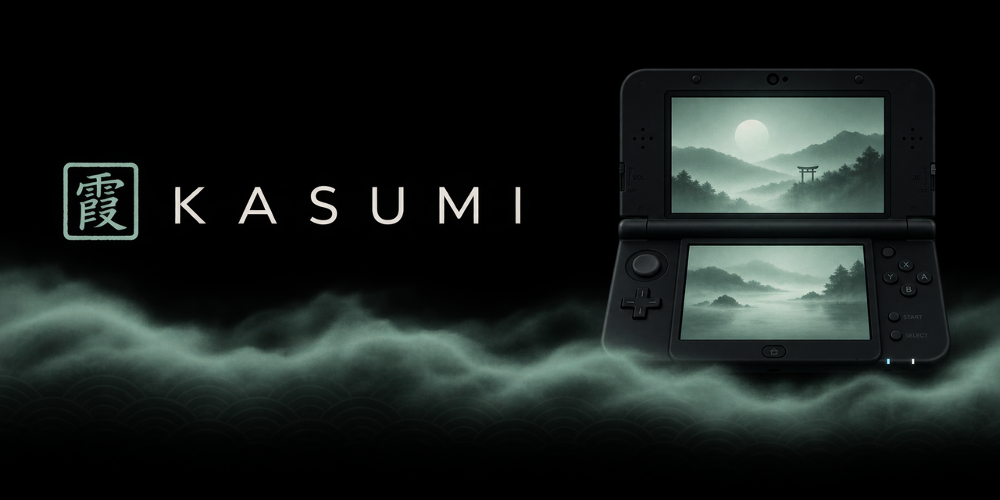
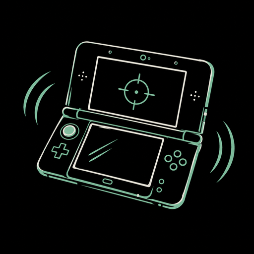
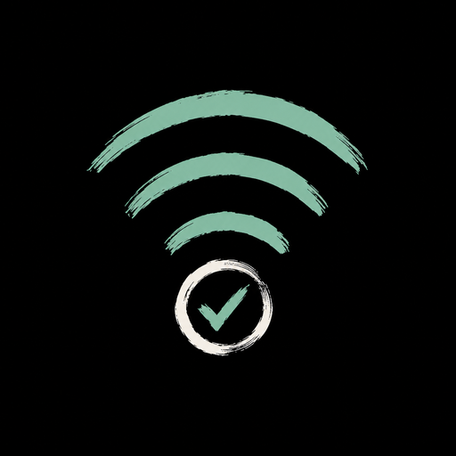

<p align="center">
  
</p>

<p align="center">
  <b>Play your GeForce NOW games on the New Nintendo 3DS.</b><br>
  A native, unofficial GeForce NOW client with a calm, OLED-black design.
</p>

---

**Kasumi** (霞, "mist") streams your GeForce NOW library to the New 3DS, New
3DS XL and New 2DS XL. The games run on NVIDIA's servers; the 3DS decodes the
video in hardware, plays the audio and sends your buttons back. It is not
affiliated with NVIDIA or with the OpenNOW project.

> **Status: beta.** Kasumi is in active development and testing. Expect rough
> edges, and please report what you find.

## Features

<table>
  <tr>
    <td align="center" width="33%">
      <br>
      <b>Plays like a controller</b><br>
      PlayStation-style layout, touch L3 / R3 / PS, and optional gyro aiming.
    </td>
    <td align="center" width="33%">
      <br>
      <b>Readable on a small screen</b><br>
      The top screen's 800-pixel mode, zoom, and saved zoom zones per game.
    </td>
    <td align="center" width="33%">
      <br>
      <b>Tuned for 3DS Wi-Fi</b><br>
      Smooth frame pacing, loss recovery and a built-in connection check.
    </td>
  </tr>
</table>

- **Your library with box art**, saved on the SD card so it opens instantly,
  with All / Favourites / Recent tabs and a page for every game.
- **Per-game options**: bitrate, gyro and button layout just for that game.
- **Stream menu** (hold START + SELECT): screenshots, controls sheet, zoom
  zones, gyro, sound and disconnect.
- **Remote keyboard and touchpad** for PC menus and launchers.
- **Comfort**: five colour themes, stream volume, session timer, automatic
  reconnect, and pause-on-lid-close that resumes on the same rig.
- **First-run guide** that walks you through everything (skippable).

## Requirements

- A **New** Nintendo 3DS, New 3DS XL or New 2DS XL (the original 3DS lacks the
  video decoder).
- Custom firmware ([Luma3DS](https://3ds.hacks.guide/)) to install homebrew.
- A GeForce NOW account (the free tier works, with a queue and one-hour
  sessions).
- 2.4 GHz Wi-Fi with a good signal (3 bars is best).

## Install

Download `Kasumi.cia` from the
[Releases](https://github.com/p0mpurin/Kasumi/releases) page and install it
with FBI, or copy `Kasumi.3dsx` to `sdmc:/3ds/` and start it from the
Homebrew Launcher.

## Getting started

1. Open Kasumi and follow the short guide.
2. Press **A** to sign in. Open the web address shown on your phone or
   computer and enter the code. No password is ever typed on the 3DS.
3. Your library loads with box art. Press **A** on a game to open it, then
   **A** again to play.
4. During play, hold **START + SELECT** for the stream menu.

## Controls

| In menus | |
|---|---|
| D-Pad / Circle Pad | Move |
| A / B | Select / Back |
| L / R | Library tabs |
| X / Y | Search / Refresh library |
| SELECT | Settings |

| In game | |
|---|---|
| Face buttons | PlayStation positions (bottom = Cross); Letters layout in Settings |
| Circle Pad / C-Stick | Left / right stick |
| L R / ZL ZR | L1 R1 / L2 R2 (swappable) |
| Touch screen | L3, R3 and PS buttons; KEYS, POINTER, ZOOM and MENU |
| START + SELECT (hold) | Stream menu |

**Remote keyboard:** tap keys or use the D-Pad and A. B deletes, Y is space,
START is Enter, L is Shift (twice for Caps Lock), R switches symbols, ZL is
Tab, X closes. Typed text is never stored or logged.

## Tips

- **Choppy picture?** Move closer to the router, or set Bitrate to
  *Steady 1 Mbps* (Settings, or just for one game in its Options).
- **Small text?** Use ZOOM and drag the map; save the spot as a zoom zone.
- **Gyro:** *While aiming* only steers while ZL is held, which suits most
  shooters.
- **Connection check** (Settings > System) measures Wi-Fi, latency and speed
  and suggests a bitrate.

## Privacy

Your login is stored only on your SD card in `sdmc:/3ds/kasumi/gfn-session.json`.
**Never share that file.** The diagnostic log (`kasumi-diagnostic.txt`)
excludes tokens and passwords and is safe to attach to bug reports.

## Reporting problems

Open an [issue](https://github.com/p0mpurin/Kasumi/issues) with
`sdmc:/3ds/kasumi/kasumi-diagnostic.txt` attached and, after a crash, the
newest Luma crash dump. Mention your model, Wi-Fi bars and bitrate setting.

## Building

Install devkitPro with the 3DS packages (plus CMake):

```sh
pacman -S --needed 3ds-dev 3ds-curl 3ds-jansson 3ds-mbedtls 3ds-libopus 3ds-cmake
```

From devkitPro MSYS in the repository root, build the WebRTC transport once,
then the app:

```sh
bash tools/build-transport.sh
make
make cia MAKEROM=/path/to/makerom BANNERTOOL=/path/to/bannertool
```

`make` produces `Kasumi.3dsx`; `make cia` needs
[makerom](https://github.com/3DSGuy/Project_CTR) and
[bannertool](https://github.com/Steveice10/bannertool). How the stream,
pacing and input work is described in [docs/TECHNICAL.md](docs/TECHNICAL.md).

## Credits

Kasumi builds on the open-source OpenNOW family of GeForce NOW clients,
especially [OpenNOW-Switch](https://github.com/OpenCloudGaming/OpenNOW-Switch)
and OpenNOW-Vita, and on libpeer, libsrtp, usrsctp, mbedTLS, libcurl,
jansson, libopus, stb_image, citro2d and libctru. MVD and zoom work was
informed by [Moonlight-N3DS](https://github.com/zoeyjodon/moonlight-N3DS).

GeForce NOW and NVIDIA are trademarks of NVIDIA Corporation. Nintendo 3DS is
a trademark of Nintendo. Kasumi is an unofficial fan project and is not
affiliated with or endorsed by either company.
