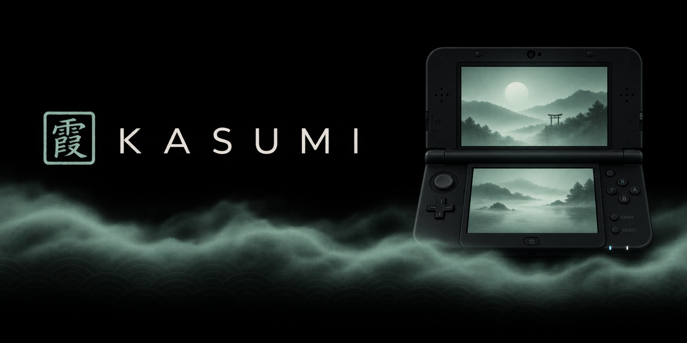
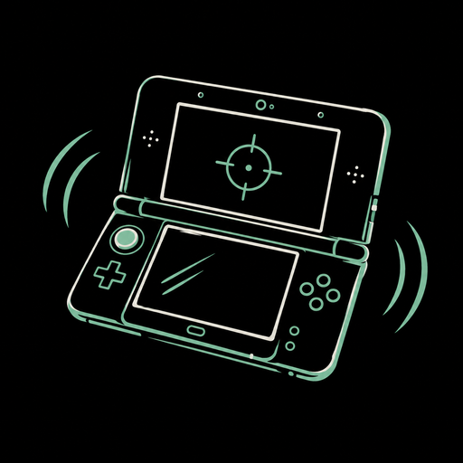
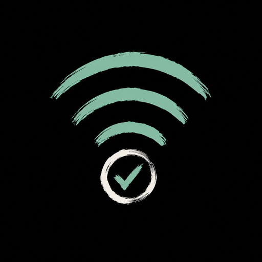
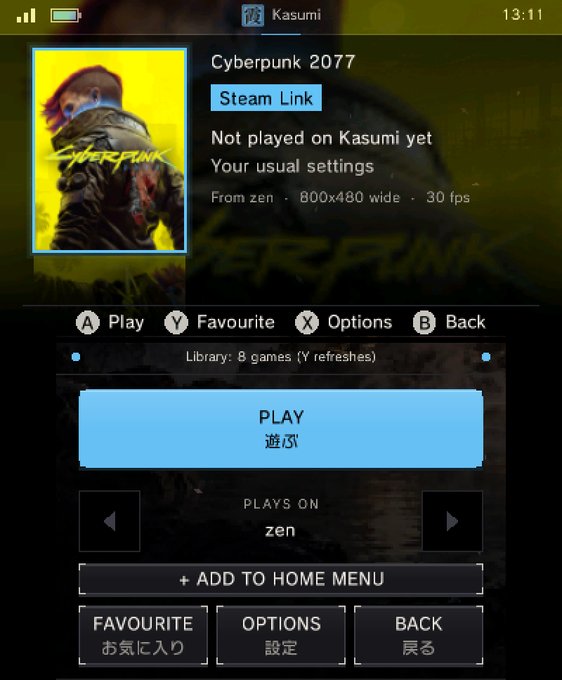
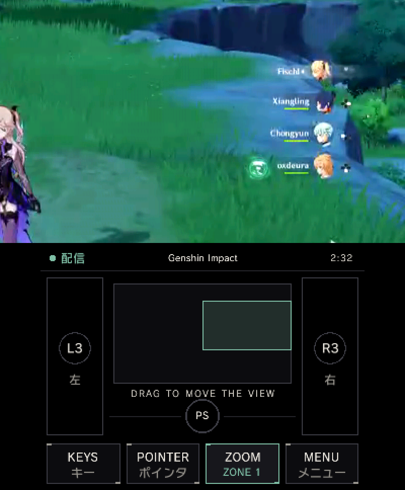
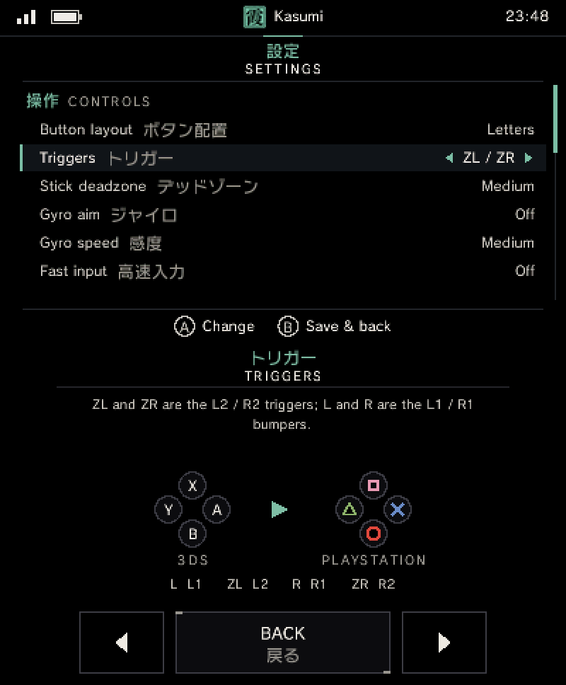
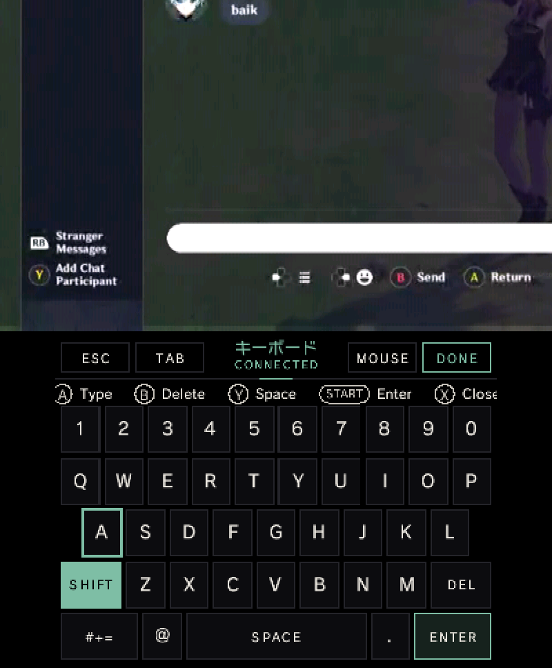

<p align="center">
  
</p>

<p align="center">
  <b>Play your GeForce NOW games on the New Nintendo 3DS.</b><br>
  A native, unofficial GeForce NOW client with a calm, OLED-black design.
</p>

<p align="center">
  <a href="https://github.com/p0mpurin/Kasumi/releases"></a>
  <a href="https://github.com/p0mpurin/Kasumi/releases"></a>
  
  <a href="LICENSE"></a>
  <a href="https://discord.gg/K9Jy3t7YHE"></a>
</p>

<p align="center">
  <a href="https://github.com/p0mpurin/Kasumi/releases"><b>Download</b></a> ·
  <a href="#getting-started">Getting started</a> ·
  <a href="#faq">FAQ</a> ·
  <a href="https://discord.gg/K9Jy3t7YHE">Discord</a> ·
  <a href="https://github.com/p0mpurin/Kasumi/issues/new/choose">Report a problem</a>
</p>

---

**Kasumi** (霞, "mist") streams your GeForce NOW library to the New 3DS, New
3DS XL and New 2DS XL: **cloud gaming on the 3DS, no PC needed**. Play your
Steam, Epic and other PC games on a 3DS; they run on NVIDIA's servers, while
the 3DS decodes the video in hardware, plays the audio and sends your buttons
back. It is not affiliated with NVIDIA or with the OpenNOW project.

<p align="center">
  <a href="https://www.youtube.com/watch?v=mM7W9iZ7E_Q"></a><br>
  <sub>▶ Watch the showcase on YouTube</sub>
</p>

> **Public beta.** Kasumi works well for everyday play, but it is still in
> active development: expect rough edges, and please report what you find.

## Features

<table>
  <tr>
    <td align="center" width="33%">
      <br>
      <b>Plays like a controller</b><br>
      PlayStation-style layout, touch L3 / R3 / PS, and optional gyro aiming.
    </td>
    <td align="center" width="33%">
      <br>
      <b>Readable on a small screen</b><br>
      The top screen's 800-pixel mode, zoom, and saved zoom zones per game.
    </td>
    <td align="center" width="33%">
      <br>
      <b>Tuned for 3DS Wi-Fi</b><br>
      Uses both New 3DS CPU cores, smooth frame pacing and a built-in connection check.
    </td>
  </tr>
</table>

- **Works in your country**: *Server* on Auto pings every GeForce NOW server
  and uses the fastest, measured again on each new Wi-Fi network. Where
  GeForce NOW is sold by a local partner (the GeForce NOW Alliance), pick it
  in Settings and sign in with that account.
- **Gets you into the game**: Kasumi follows your place in the queue as
  NVIDIA moves it between servers, offers to resume or end a game still
  running on your account, and when NVIDIA is still releasing your last
  session it counts down and tries again by itself.
- **Steadier Wi-Fi while you play**: StreetPass, SpotPass and other
  background Wi-Fi work pause during a game (like Moonlight does), so the
  radio stays on the stream. If a network was choppy last time, the next
  session there starts in *Weak / hotspot* mode by itself.
- **Your library with box art**, saved on the SD card so it opens instantly,
  with All / Favourites / Recent tabs and a page for every game.
- **Per-game options**: bitrate, gyro, button layout and a fully **custom
  button mapping** just for that game.
- **Queue with an estimate and an alert**: the free-tier queue shows a wait
  time that learns from your own queues. Close the lid while you wait; when
  the rig is ready the notification light pulses and a chime plays.
- **Picks up where you left off**: *Continue* relaunches your last game in
  one press, and if Kasumi ever closes mid-game, the next start offers to
  resume the game still running on your rig.
- **Stream menu** (hold START + SELECT): screenshots, controls sheet, zoom
  zones, gyro, sound and disconnect.
- **Remote keyboard and touchpad** for launchers, sign-in screens and chat.
- **Comfort**: five colour themes, stream volume, session timer, and
  automatic reconnect, including after closing the lid, back onto the same
  rig.
- **First-run guide** that walks you through everything (skippable).
- **Updates itself** from GitHub, with release notes on the console; the
  update page opens by itself when a new version is out.

## Screenshots

<table>
  <tr>
    <td align="center"><br>Playing, with live stats</td>
    <td align="center"><br>A game's page</td>
    <td align="center"><br>Stream menu</td>
  </tr>
  <tr>
    <td align="center"><br>Zoom zones for small text</td>
    <td align="center"><br>Settings</td>
    <td align="center"><br>Remote keyboard</td>
  </tr>
</table>

## Requirements

- A **New** Nintendo 3DS, New 3DS XL or New 2DS XL (the original 3DS lacks the
  video decoder).
- Custom firmware ([Luma3DS](https://3ds.hacks.guide/)) to install homebrew.
- A GeForce NOW account, from NVIDIA or from a GeForce NOW Alliance partner
  (the free tier works, with a queue and one-hour sessions).
- 2.4 GHz Wi-Fi with a good signal (3 bars is best).

## Install


**Quickest:** open **FBI** on the 3DS, choose **Remote Install > Scan QR
Code**, and scan the code on the right. FBI downloads and installs the
latest Kasumi.cia directly.

Or download `Kasumi.cia` from the
[Releases](https://github.com/p0mpurin/Kasumi/releases) page and install it
with FBI, or copy `Kasumi.3dsx` to `sdmc:/3ds/` and start it from the
Homebrew Launcher.

After that, Kasumi updates itself: **Settings > Updates** shows what's new
and installs the latest release in place (it checks automatically, only in
the menus). Your login, library and settings are kept. Every download is
checked against the release's SHA256SUMS before anything is installed.

## Getting started

1. Open Kasumi and follow the short guide.
2. Press **A** to sign in. Open the web address shown on your phone or
   computer and enter the code. No password is ever typed on the 3DS.
   Most accounts are NVIDIA's (the default). If you bought GeForce NOW from a
   local partner, first pick it in **Settings > Account > GeForce NOW
   provider**, then sign in.
3. Your library loads with box art. Press **A** on a game to open it, then
   **A** again to play.
4. During play, hold **START + SELECT** for the stream menu.

## Controls

| In menus | |
|---|---|
| D-Pad / Circle Pad | Move |
| A / B | Select / Back |
| L / R | Library tabs |
| X / Y | Search / Refresh library |
| SELECT | Settings |

| In game | |
|---|---|
| Face buttons | PlayStation positions (bottom = Cross); Letters layout in Settings |
| Circle Pad / C-Stick | Left / right stick |
| L R / ZL ZR | L1 R1 / L2 R2 (swappable) |
| Touch screen | L3, R3 and PS buttons; KEYS, POINTER, ZOOM and MENU |
| START + SELECT (hold) | Stream menu |

**Remote keyboard:** tap keys or use the D-Pad and A. B deletes, Y is space,
START is Enter, L is Shift (twice for Caps Lock), R switches symbols, ZL is
Tab, X closes. Typed text is never stored or logged.

**Custom mapping:** open a game, press X (Options) and choose *Button
mapping*. Press any 3DS button to pick it, then use the Circle Pad (or the
arrows) to choose what it sends: any PlayStation button, trigger, stick
click, D-Pad direction, or nothing. Only that game uses the mapping.

## Tips

- **Choppy picture?** Move closer to the router, or set Bitrate to
  *Steady 1 Mbps* (Settings, or just for one game in its Options).
- **Want more detail?** On strong Wi-Fi (3 bars), set Bitrate to *Sharp*.
- **Phone hotspot or far from the router?** Set Settings > Network >
  *Connection type* to **Weak / hotspot**: a steadier, slightly softer picture
  that copes with mobile data.
- **High ping?** Settings > Network > *Server* on Auto picks the GeForce NOW
  server with the lowest ping from wherever you are; you can also pick one
  yourself.
- **Small text?** Use ZOOM and drag the map; save the spot as a zoom zone.
- **Gyro:** *While aiming* only steers while ZL is held, which suits most
  shooters.
- **Connection check** (Settings > System) measures Wi-Fi, latency and speed
  and suggests a bitrate.

## FAQ

**Can you cloud game on a 3DS without a PC?**
Yes. With Kasumi, a New 3DS streams games straight from GeForce NOW's cloud
servers. You don't need a gaming PC, only the 3DS, Wi-Fi and a GeForce NOW
account.

**How do I play Steam or other PC games on a 3DS?**
Link your Steam, Epic, Ubisoft or other store account in GeForce NOW (on
[play.geforcenow.com](https://play.geforcenow.com) or its app), then launch the
game from Kasumi's library. The game runs on NVIDIA's servers using the copy
you own, and the 3DS is your screen and controller.

**How is Kasumi different from Moonlight?**
[Moonlight](https://github.com/zoeyjodon/moonlight-N3DS) streams games from
*your own* PC at home. Kasumi streams from GeForce NOW's servers, so no PC is
needed. If you have a gaming PC, Moonlight is a great option too.

**Do I need a paid GeForce NOW membership?**
No. The free tier works, with a queue before each session and a one-hour
limit. Kasumi shows the queue with a wait estimate and warns you before the
hour ends.

**Does it work on an original 3DS or 2DS?**
No. Kasumi decodes video with the hardware decoder that only the "New"
models have.

**Why 30 FPS, and which bitrate?**
The 3DS screen and decoder are built for 30 FPS video. Kasumi streams about
1.3 Mbps by default (*Adaptive*), about 1.8-2 Mbps with *Sharp* on strong
Wi-Fi, and about 1 Mbps with *Steady 1 Mbps* for weak Wi-Fi or a phone
hotspot. (Before 0.9.0-beta.25, a too-small network buffer lost packets above
about 1 Mbps, so higher rates stuttered; that is fixed.)

**How is the latency?**
It depends mostly on your distance to NVIDIA's servers and on your Wi-Fi. In
testing, the network round trip was around 60-80 ms, plus one or two frames
that Kasumi holds back to keep the picture smooth. It feels fine for
adventure, RPG and most action games, less so for competitive shooters. The
stream stats show your live ping.

**Is my account safe? Should I link Steam?**
Kasumi signs in through NVIDIA's own device-code page on your phone or PC and
never sees your NVIDIA password. It never sees your Steam password either:
store accounts are linked inside GeForce NOW itself, not in Kasumi. The code
is open source, so anyone can check what it does. It is an unofficial client,
so, as with any third-party client, use it at your own discretion.

**My game save is gone. Did Kasumi delete it?**
No. Kasumi never touches saves: they are kept by the game's store (Steam
Cloud, Epic, Ubisoft...) or the game's own account. Leaving the stream closes
the game at once, so **quit from the game's own menu first** to let it save
and sync. Also check you launched the same store's version as before.

**GeForce NOW in my country is sold by a local partner. Does it work?**
Yes (still new). In some countries GeForce NOW is run by a GeForce NOW
Alliance partner with its own accounts and servers. Open **Settings > Account
> GeForce NOW provider**, pick your partner, sign out if you were signed in,
and sign in again; your library, servers and sessions then go through that
partner. The list comes from NVIDIA, and players have confirmed it works with
ABYA and Digevo (Chile) and Pentanet (Australia). Keep *NVIDIA* if your
account is NVIDIA's own, even when a partner exists in your country. Partner
queues can be much longer than NVIDIA's.

**"This account can't stream here" or an empty library?**
Usually the account and the provider don't match: an NVIDIA account signed in
through a partner, or a partner account signed in through NVIDIA. Change
**Settings > Account > GeForce NOW provider**, sign out and sign in again.

**"Launch failed" or a countdown before my game starts?**
- **Session limit (HTTP 403)**: NVIDIA still counts an earlier session (it
  can take a few minutes to release one), or GeForce NOW is open on another
  device. If a game is running elsewhere, Kasumi offers to resume it here or
  end it; otherwise it counts down and tries again by itself. Closing
  GeForce NOW on your other devices and browser tabs helps.
- **Too many requests (HTTP 429)**: NVIDIA limits launch attempts after
  several in a row. Kasumi waits it out and tries again by itself; pressing
  launch over and over makes it last longer.
- **"Limited mode" (HTTP 500)**: NVIDIA has restricted streaming on the
  account itself. Check whether it can play on
  [play.geforcenow.com](https://play.geforcenow.com); if not, the account needs
  sorting out with NVIDIA.

**Kasumi asked me to sign in again. Why?**
Your login is renewed in the background. If NVIDIA can't be reached at that
moment (no Wi-Fi yet, a busy server), Kasumi keeps your login and just asks
you to try again; you only need to sign in again when NVIDIA no longer
accepts the old login.

**Does it run on an emulator (Citra / Azahar)?**
No. Kasumi needs the New 3DS hardware video decoder and a real network
connection.

**What happens when I close the lid mid-game?**
The 3DS turns Wi-Fi off when the lid closes, so the stream stops. Kasumi keeps
your game on the rig and reconnects on its own when you open the lid again.

**Which games work?**
Any game in your GeForce NOW library. Kasumi shows up as a standard
controller, so games with controller support work out of the box, and Steam
games work too even without native controller support, because Steam Input
translates the controller for them. The touchpad and keyboard are for
navigating launchers, sign-in screens and chat, not for playing.

## Privacy

**Who Kasumi talks to.** NVIDIA (sign-in, your library, servers and game
sessions), or your GeForce NOW partner if you picked one; GitHub, to check
for and download updates; and Kasumi's report service, only if you allow it
(below). When a game starts, the stream also asks NVIDIA's and Google's
public STUN servers for your public address, as browsers do for video calls
and GeForce NOW in a browser; nothing else is sent to them.

**What stays on your SD card** (`sdmc:/3ds/kasumi/`):

- `gfn-session.json`: your login. **Never share that file.** No password is
  in it (you never type one on the 3DS), but it lets anyone use your
  GeForce NOW account until it expires.
- Your settings, library cache, chosen provider, a random console ID made by
  Kasumi, and the diagnostic logs.
- The names of Wi-Fi networks you played on, with their fastest server and
  whether the last session there was choppy. They are used to pick the server
  and *Weak / hotspot* mode, and are never logged or sent anywhere.

The diagnostic logs (`kasumi-diagnostic.txt` and
`kasumi-diagnostic-previous.txt`) exclude tokens, passwords and anything you
type, and are safe to attach to bug reports.

**Sharing is opt-in.** Kasumi asks once, **"Help improve Kasumi?"**. If you
choose *Share*, it sends:

- **Problem reports**: the log, on its own when something goes wrong (the
  previous run crashed, froze or lost power, a game failed to launch, or the
  stream could not reconnect), at most once per run and never during a game.
- **Performance stats**: after each session of 30 seconds or more, a few
  numbers (session length, game, server, ping, bitrate, frame rate, lost and
  repeated frames, reconnects, decode time), and for each launch whether the
  game started and why not, the provider, queue time and how long it took.
  Each comes with Kasumi's version and the random install ID, so one
  console's numbers can be grouped. No log text, no account, no addresses.
  Kept 90 days.

If you choose *No thanks*, nothing is ever sent unless you use **Send
diagnostic report** yourself. Change either one anytime under Settings >
System (*Share problem reports*, *Share performance stats*); turning stats off
also deletes the ones not sent yet.

A report holds the logs of this run and the previous one, your
`settings.json` (including the random install ID, which is not linked to your
NVIDIA account), and the newest Luma crash dump of Kasumi from the last few
days. Public IP addresses in the logs are shortened to their first two
numbers, and your login is never included. Reports are kept for 30 days and
are only readable by the developer. The service doesn't store your IP
address: it only keeps a scrambled hourly counter to stop flooding, deleted
after an hour. The service's code is in
[`server/report-worker`](server/report-worker).

## Reporting problems

The easiest way: in Kasumi, open **Settings > System > Send diagnostic
report**, then mention the code it shows (like `K7F-2QX`) in your
[bug report](https://github.com/p0mpurin/Kasumi/issues/new?template=bug_report.yml)
or in the [Discord](https://discord.gg/K9Jy3t7YHE). Kasumi keeps the log of the
previous run too, so this works even after a crash or freeze.

You can also attach the files yourself: `sdmc:/3ds/kasumi/kasumi-diagnostic.txt`
(this run) and `kasumi-diagnostic-previous.txt` (the run before), plus, after a
crash, the newest Luma dump from `sdmc:/luma/dumps/arm11/`. Ideas are welcome
as [feature requests](https://github.com/p0mpurin/Kasumi/issues/new?template=feature_request.yml).

## Community

<p align="center">
  <a href="https://discord.gg/K9Jy3t7YHE"></a><br>
  <b><a href="https://discord.gg/K9Jy3t7YHE">Join the Kasumi Discord</a></b><br>
  <sub>Chat with other players, get setup help, share reports and hear about new versions first.</sub>
</p>

The same code is in Kasumi under **Settings > System > Kasumi Discord**: scan it
with your phone straight from the 3DS.

## Building

Install devkitPro with the 3DS packages (plus CMake):

```sh
pacman -S --needed 3ds-dev 3ds-curl 3ds-jansson 3ds-mbedtls 3ds-libopus 3ds-cmake
```

From devkitPro MSYS in the repository root, build the WebRTC transport once,
then the app:

```sh
bash tools/build-transport.sh
make
make cia MAKEROM=/path/to/makerom BANNERTOOL=/path/to/bannertool
```

`make` produces `Kasumi.3dsx`; `make cia` needs
[makerom](https://github.com/3DSGuy/Project_CTR) and
[bannertool](https://github.com/Steveice10/bannertool). How the stream,
pacing and input work is described in [docs/TECHNICAL.md](docs/TECHNICAL.md).

To publish a release, set the version in the Makefile, write
`docs/releases/v<version>.md`, and run `bash tools/make-release.sh` (with
`MAKEROM` and `BANNERTOOL` set); it builds the CIA, the .3dsx and
`SHA256SUMS` and prints the `gh release create` command.

## Credits

Kasumi builds on the open-source OpenNOW family of GeForce NOW clients,
especially [OpenNOW-Switch](https://github.com/OpenCloudGaming/OpenNOW-Switch)
and OpenNOW-Vita, and on libpeer, libsrtp, usrsctp, mbedTLS, libcurl,
jansson, libopus, stb_image, citro2d and libctru. MVD and zoom work was
informed by [Moonlight-N3DS](https://github.com/zoeyjodon/moonlight-N3DS), and its
[moonlight-common-c](https://github.com/moonlight-stream/moonlight-common-c)
3DS socket code showed how to get the largest receive buffer the 3DS allows.
Voice chat's echo cancellation and microphone setup follow
[TriCord](https://github.com/2b-zipper/TriCord), the 3DS Discord client.

Kasumi's voice is VOICEVOX:春日部つむぎ ([VOICEVOX](https://voicevox.hiroshiba.jp)).
The Home Menu jingle and sound effects are original, made with
[`tools/audio`](tools/audio). Menu music from [Pixabay](https://pixabay.com/music/)
under the Pixabay Content License: "Bossa Nova Cafe Morning Breeze" by Alex Morgan
(573876), "Bossa Nova Morning Music" by Andriih (599227) and "Bossa Nova or Lofi"
by TheBoysBeats (296432).

GeForce NOW and NVIDIA are trademarks of NVIDIA Corporation. Nintendo 3DS is
a trademark of Nintendo. Kasumi is an unofficial fan project and is not
affiliated with or endorsed by either company.

## License

Kasumi is free software under the [GNU General Public License v3.0](LICENSE):
you may use, study, share and modify it, and anything you distribute that is
based on it must stay under the GPL with its source available. Third-party
components keep their own licences; see [THIRD_PARTY.md](THIRD_PARTY.md).
